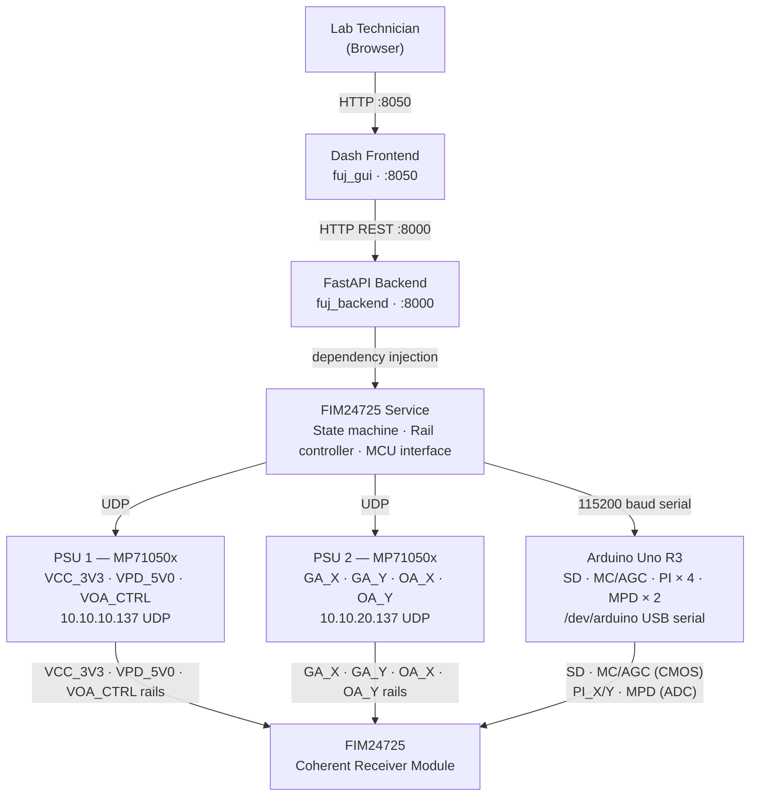

# FUJ Coherent Receiver GUI — Architecture

## System Overview

### Block Diagram



### Detailed ASCII diagram

```
┌─────────────────────────────────────────────────────────────────────────┐
│                    Lab Technician (Browser)                             │
│                    Local or via Tailscale VPN                           │
└─────────────────────────────────────────────────────────────────────────┘
                                   ↓ HTTP  :8050
┌─────────────────────────────────────────────────────────────────────────┐
│                       DASH FRONTEND  (fuj_gui)                          │
│                                                                         │
│  components/                         callbacks/                         │
│  ┌──────────────────────────────┐    ┌──────────────────────────────┐  │
│  │ header.py                    │    │ status.py                    │  │
│  │  State badge, mode toggle,   │    │  500 ms poll → GET /status   │  │
│  │  STARTUP/SHUTDOWN buttons,   │    │  Updates header, controls,   │  │
│  │  confirmation modals, toast  │    │  pre-staging badges          │  │
│  ├──────────────────────────────┤    ├──────────────────────────────┤  │
│  │ controls.py                  │    │ graph.py                     │  │
│  │  VOA / OA_X / OA_Y /         │    │  Registers clientside JS     │  │
│  │  GA_X / GA_Y input rows      │    │  callbacks (no round-trips)  │  │
│  ├──────────────────────────────┤    ├──────────────────────────────┤  │
│  │ graph.py                     │    │ logs.py                      │  │
│  │  Plotly PI/MPD time-series   │    │  2 s delta poll → GET /logs  │  │
│  ├──────────────────────────────┤    │  Client-side accumulation    │  │
│  │ logs.py                      │    └──────────────────────────────┘  │
│  │  Scrollable log panel        │                                       │
│  └──────────────────────────────┘    assets/graph_callbacks.js          │
│                                       Graph accumulation + render in     │
│  api_client.py (httpx session)        browser — 0 extra round-trips     │
└────────────────────────────────────────────┬────────────────────────────┘
                                             ↓ HTTP REST  :8000
┌─────────────────────────────────────────────────────────────────────────┐
│                    FASTAPI BACKEND  (fuj_backend)                       │
│                                                                         │
│  API LAYER  (api/)                                                      │
│  ┌─────────────────────────────────────────────────────────────────┐   │
│  │  routes/service.py          routes/controls.py                  │   │
│  │  GET  /api/v1/status        POST /api/v1/controls/voa           │   │
│  │  POST /api/v1/startup       POST /api/v1/controls/oa_x          │   │
│  │  POST /api/v1/shutdown      POST /api/v1/controls/oa_y          │   │
│  │  POST /api/v1/mode          POST /api/v1/controls/ga_x          │   │
│  │                             POST /api/v1/controls/ga_y          │   │
│  │  routes/telemetry.py        POST /api/v1/controls/sweep_ga      │   │
│  │  GET  /api/v1/telemetry/peak_indicators                         │   │
│  │  GET  /api/v1/telemetry/mpd    routes/logs.py                   │   │
│  │                             GET  /api/v1/logs                   │   │
│  │                                                                 │   │
│  │  app.py: CORS, TrustedHost, slowapi rate limiting               │   │
│  │  log_buffer.py: 500-line ring buffer (fim24725.* loggers)       │   │
│  └──────────────────────────┬──────────────────────────────────────┘   │
│                              ↓ dependency injection (deps.py)           │
│  SERVICE LAYER  (services/)                                             │
│  ┌─────────────────────────────────────────────────────────────────┐   │
│  │                                                                 │   │
│  │  fim24725_service.py (FIM24725Service)                          │   │
│  │  ┌───────────────────────────────────────────────────────────┐ │   │
│  │  │  threading.RLock + @synchronized on all public methods    │ │   │
│  │  │                                                           │ │   │
│  │  │  startup(mode)      set_voa(v)     read_peak_indicators() │ │   │
│  │  │  shutdown()         set_oa_x/y(v)  read_mpd()            │ │   │
│  │  │  set_mode(mode)     set_ga_x/y(v)  read_mpd_n()          │ │   │
│  │  │  get_snapshot()     sweep_ga(...)  close()                │ │   │
│  │  └───────────────────────────────────────────────────────────┘ │   │
│  │                                                                 │   │
│  │  ┌─────────────────┐  ┌─────────────────┐  ┌────────────────┐ │   │
│  │  │ state_machine.py│  │rail_controller.py│  │mcu_interface.py│ │   │
│  │  │                 │  │                 │  │                │ │   │
│  │  │ OFF→STARTING    │  │ Named rail →    │  │ set_shutdown() │ │   │
│  │  │ →READY          │  │ (PSU, channel)  │  │ set_mode()     │ │   │
│  │  │ →SHUTTING_DOWN  │  │ bounds enforce  │  │ read_peak_     │ │   │
│  │  │ →FAULT (any)    │  │ OVP/OCP config  │  │  indicators()  │ │   │
│  │  │ fault(info)     │  │ verify_rails()  │  │ read_mpd()     │ │   │
│  │  └─────────────────┘  └────────┬────────┘  │ MockMCU (dev)  │ │   │
│  │                                │            └────────────────┘ │   │
│  │  ┌─────────────────────────────┴─────────────────────────────┐ │   │
│  │  │ rail_config.py (RailRegistry — single source of truth)    │ │   │
│  │  │                                                           │ │   │
│  │  │  VCC_3V3 (PSU1 ch1) VPD_5V0 (PSU1 ch2) VOA_CTRL (PSU1 ch3)│ │ │
│  │  │  GA_X    (PSU2 ch1) GA_Y    (PSU2 ch2)                   │ │   │
│  │  │  OA_X    (PSU2 ch3) OA_Y    (PSU2 ch4)                   │ │   │
│  │  └───────────────────────────────────────────────────────────┘ │   │
│  └──────────────────────────┬──────────────────────────────────────┘   │
│                              ↓                                          │
│  HARDWARE LAYER  (hardware/)                                            │
│  ┌──────────────────────────────────────┐  ┌────────────────────────┐  │
│  │ psu_hal.py                           │  │ arduino_mcu.py         │  │
│  │                                      │  │                        │  │
│  │ PsuTransportUDP                      │  │ ArduinoMCU             │  │
│  │  └─→ MP71050x (one per PSU)          │  │ 115200 baud serial     │  │
│  │        └─→ Channel (ch 1-4)          │  │ background reader      │  │
│  │             set_voltage/current      │  │                        │  │
│  │             measure_voltage/current  │  │ D2 → SD (shutdown)     │  │
│  │             output(on/off)           │  │ D3 → MC/AGC (mode)     │  │
│  │             OVP/OCP config           │  │ A0-A3 ← PI_XI/XQ/YI/YQ│  │
│  │             threading.Lock per PSU   │  │ A4-A5 ← MPD+/MPD-     │  │
│  └──────────────────────────────────────┘  └────────────────────────┘  │
└──────────────┬─────────────────────────────────────┬────────────────────┘
               ↓ UDP  PSU1:20001  PSU2:20002         ↓ USB serial 115200
┌──────────────────────────┐             ┌───────────────────────────────┐
│ PSU1 — MP71050x          │             │ Arduino Uno R3                │
│ 10.10.10.137             │             │ /dev/arduino                  │
│ Ch1: VCC_3V3  3.3V 500mA │             │                               │
│ Ch2: VPD_5V0  5.0V  50mA │             │ FIM24725 SD, MC/AGC pins      │
│ Ch3: VOA_CTRL 0–4.8V     │             │ Peak indicator ADC (A0-A3)    │
│                           │             │ Monitor photodiode (A4-A5)    │
├──────────────────────────┤             └──────────────┬────────────────┘
│ PSU2 — MP71050x          │                            │ CMOS signals
│ 10.10.20.137             │                            │ (33kΩ+22kΩ divider)
│ Ch1: GA_X   0–3.3V  20mA │                            ↓
│ Ch2: GA_Y   0–3.3V  20mA │             ┌──────────────────────────────┐
│ Ch3: OA_X   0.5–2V  20mA │             │ FIM24725 Coherent Receiver   │
│ Ch4: OA_Y   0.5–2V  20mA │             │ SD, MC/AGC, GA_X, GA_Y,      │
└──────┬───────────────────┘             │ OA_X, OA_Y, PI_XI/XQ/YI/YQ, │
       └─────────────────────────────────→ VCC_3V3, VPD_5V0             │
                           Supply rails   └──────────────────────────────┘
```

---

## State Machine

```
         startup()
OFF ──────────────→ STARTING ──────────────→ READY
 ↑                     │                      │  ↑
 │                     │ fault                │  │ set_mode()
 │                     ↓                      │  │ set_voa/oa/ga()
 │               ┌──────────┐                 │  │ read_pi/mpd()
 │               │  FAULT   │ ←───────────────┘  │
 │               └────┬─────┘                    │
 │                    │ shutdown()                │ shutdown()
 │                    ↓                           ↓
 └──────────────── SHUTTING_DOWN ←────────────────┘
```

| State | Meaning |
|---|---|
| `OFF` | Service created; no hardware enabled. The device starts here on API launch. |
| `STARTING` | Power-on sequence running: PSU rails brought up, MCU handshake. |
| `READY` | All rails verified, MCU connected; control commands accepted. |
| `SHUTTING_DOWN` | Orderly power-down sequence in progress. |
| `FAULT` | A fault occurred; module output disabled via SD pin. Call `shutdown()` to power down rails and return to `OFF`. |

Transitions are enforced by `StateMachine`. Any step can transition to `FAULT`.
`startup()` is never called automatically — the operator triggers it via `POST /api/v1/startup`.

---

## Power Sequencing

**Bring-up** (`startup()`):

```
Step 0: Lock PSU front panels          — prevent accidental physical button presses
Step 1: Verify initial safe state
          MCU must be connected
          Set MCU SD=1 (D2 LOW)        — module disabled before any rail comes up
          Set MCU mode = AGC           — safe default
          Disable all PSU outputs      — ensure clean starting point
Step 2: Program protections & setpoints — OVP/OCP/Vset/Iset for ALL rails
                                          (configured before any output is enabled)
Step 3: Enable VPD_5V0, verify         — photodiode supply FIRST (±5% voltage check)
Step 4: Enable VCC_3V3, verify         — amplifier supply SECOND (±5% voltage/current check)
Step 5: Set initial control values     — VOA/GA/OA to nominal voltages (outputs still off)
Step 6: Enable control rails           — turn on VOA, GA_X/Y, OA_X/Y outputs
          Verify PSU1 reachable via VOA_CTRL measurement
          Verify PSU2 reachable via GA_X measurement
Step 7: Settling delay (500 ms)        — rails stabilise before module is enabled
Step 8: Enable module output
          Set MCU mode (AGC or MGC)
          Set MCU SD=0 (D2 HIGH)       — module enabled
Step 9: Validate PI readings           — warn if any channel appears railed (< 0.1 V or > 1.9 V)
→ Transition to READY
```

**Power-down** (`shutdown()`):

```
Step 1: Set MCU SD=1 (D2 LOW)          — disable module output first
Step 2: Disable control rails          — VOA, GA_X/Y, OA_X/Y → 0 V
                                          (must happen before VCC to avoid driving
                                           control pins above supply rail)
Step 3: Disable VCC_3V3               — amplifier supply off BEFORE photodiode supply
Step 4: Disable VPD_5V0               — photodiode supply off LAST
→ Transition to OFF
Step 5: Unlock PSU front panels
```

> **Critical:** Violating the power sequence (amplifiers before photodiodes on bring-up,
> or photodiodes before amplifiers on shutdown) can cause permanent damage to the FIM24725.

---

## Rail Configuration

| Rail | PSU | Ch | Voltage | Current | Notes |
|---|---|---|---|---|---|
| VCC_3V3 | PSU1 | 1 | 3.3 V | 500 mA nom | Amplifier supply; OCP 700 mA |
| VPD_5V0 | PSU1 | 2 | 5.0 V | 50 mA nom | Photodiode supply; OCP 150 mA |
| VOA_CTRL | PSU1 | 3 | 0–4.8 V | 80 mA nom | Variable optical attenuator; OCP 100 mA |
| GA_X | PSU2 | 1 | 0–3.3 V | 20 mA | Gain adjust X (ignored in AGC) |
| GA_Y | PSU2 | 2 | 0–3.3 V | 20 mA | Gain adjust Y (ignored in AGC) |
| OA_X | PSU2 | 3 | 0.5–2.0 V | 20 mA | Output amplitude X |
| OA_Y | PSU2 | 4 | 0.5–2.0 V | 20 mA | Output amplitude Y |

GA rails written in AGC mode are accepted by the PSU and pre-staged for the next MGC session.
0 V is allowed for OA rails during shutdown sequences; the 0.5 V lower bound is enforced for
normal user requests at the API layer.

---

## Arduino MCU Protocol

115200 baud, ASCII, `\n`-terminated. Arduino Uno R3 at `/dev/arduino`.

**Commands (host → MCU):**

| Command | Response | Action |
|---|---|---|
| `HELLO` | `INIT:SD=1,MODE=AGC` | Sync; starts 500 ms telemetry |
| `PING` | `PONG` | Liveness check |
| `SD:1` | `SD:1` | D2 LOW — SD active (module disabled) |
| `SD:0` | `SD:0` | D2 HIGH — SD inactive (module enabled) |
| `MODE:AGC` | `MODE:AGC` | D3 HIGH — automatic gain control |
| `MODE:MGC` | `MODE:MGC` | D3 LOW — manual gain control |

**Telemetry (MCU → host, unsolicited, every 500 ms):**

```
TELE:PI_XI=x.xxx,PI_XQ=x.xxx,PI_YI=x.xxx,PI_YQ=x.xxx,MPD_P=x.xxx,MPD_N=x.xxx
```

ADC conversion: `voltage = (analogRead(pin) / 1024.0) × 3.3 V` (AREF = external 3.3 V).
All PI and MPD signals are in the 0–2 V range. Values > 2 V are discarded with a WARNING.

**Error messages:**

```
ERR:PIN_FAULT:SD    — D2 readback mismatch after write
ERR:PIN_FAULT:MODE  — D3 readback mismatch after write
ERR:UNKNOWN:<cmd>   — unrecognised command
```

---

## HAL Design Notes

The Hardware Abstraction Layer follows a **synchronous, serialized-per-device** model:

- **One `MP71050x` instance per physical PSU** — command serialization via `threading.Lock`
- **One `Channel` view per output (1–4)** — bound to its parent PSU, prevents channel/PSU confusion
- **`PsuTransportUDP`** encapsulates all socket operations — PSU logic never touches sockets directly
- **UDP transport** with per-command socket creation — reliable when local NIC IP matches PSU subnet

The HAL exposes the full command surface but enforces **no safety policies**. Validation, bounds
checking, and operating envelopes are entirely the responsibility of the Services layer above.

For the complete design rationale, see [ADR-001: PSU Hardware Abstraction Layer](docs/adr/ADR-001-psu-hal.md).
For the full API reference, see [PSU HAL API Documentation](docs/psu_hal_api.md).

---

## Services Layer Design Notes

The Services Layer provides high-level control of the FIM24725 coherent optical receiver:

- **`FIM24725Service`** — Main facade; all public methods protected by `threading.RLock` via `@synchronized`
- **`RailController`** — Maps named rails to `(PSU, channel)` pairs; enforces voltage bounds and verifies rails after programming
- **`StateMachine`** — Enforces valid state transitions; transitions to `FAULT` from any state on error
- **`RailRegistry`** — Single source of truth for OVP, OCP, nominal values, and verification tolerances
- **`MCUInterface`** — Protocol for MCU communication (`MockMCU` for development without hardware)

The services layer composes HAL objects internally and enforces all safety policies that the HAL intentionally omits.

For the complete design rationale, see [ADR-002: FIM24725 Services Layer](docs/adr/ADR-002-services-layer.md).
For the full API reference, see [Services API Documentation](docs/services_api.md).

---

## API Layer Design Notes

The API layer wraps the service facade with HTTP:

- **Rate limiting** via slowapi: 10/min (control), 300/min (status), 120/min (telemetry), 60/min (logs)
- **CORS** restricted to localhost origins; `TrustedHostMiddleware` blocks non-local requests
- **Exception mapping**: `StateError`/`SequenceError` → 409; `BoundsError` → 422; `VerificationError`/`MCUError` → 502
- **Log buffer**: `LogBufferHandler` attached to the `fim24725` logger hierarchy; 500-line ring buffer polled via `GET /api/v1/logs`
- **`GET /api/v1/status`** returns a full `SystemSnapshot` including telemetry — the UI consumes this single endpoint for all live data, avoiding separate telemetry polls

For the complete design rationale, see [ADR-004: REST API Layer](docs/adr/ADR-004-rest-api.md).
For the full API reference, see [REST API Documentation](docs/rest_api.md).

---

## GUI Design Notes

The Dash frontend uses a **poll-and-store** model driven by two `dcc.Interval` timers:

- **500 ms** — `GET /api/v1/status` → `status-store`; drives header, controls, and graph accumulation
- **2 s** — `GET /api/v1/logs?since_seq=N` (delta polling) → `log-store`; drives log panel

**Clientside rendering** (`assets/graph_callbacks.js`): both the graph-store append step and the
Plotly figure render execute entirely in the browser, consuming data already present in `status-store`.
This eliminates two Gunicorn round-trips per poll cycle.

**Log accumulation** is also browser-side: `log-store` holds up to 500 lines across all poll cycles.
The debug toggle filters locally from the store with no re-fetch.

For the full UI reference, see [GUI Documentation](docs/gui.md).
