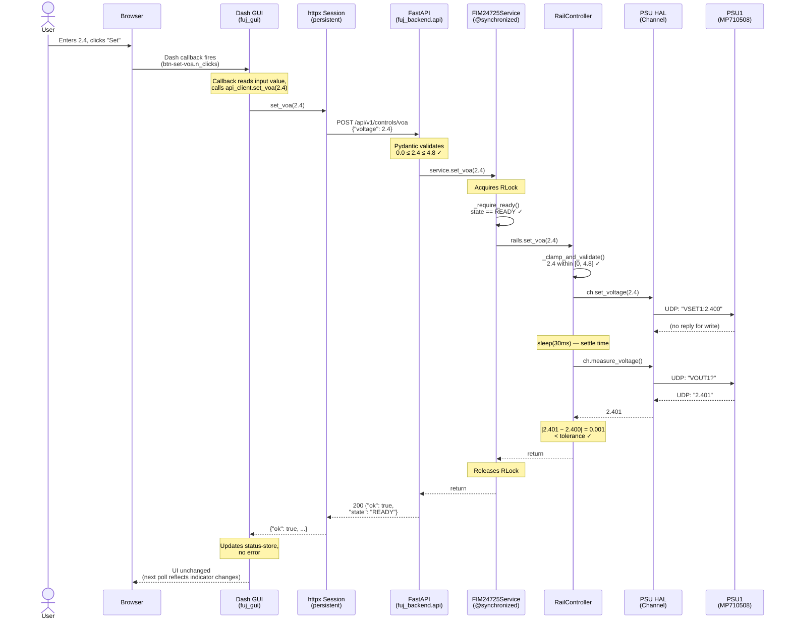

# Command Trace: Set VOA to 2.4V

```mermaid
sequenceDiagram
    actor User
    participant Browser
    participant Dash as Dash GUI<br/>(fuj_gui)
    participant httpx as httpx Session<br/>(persistent)
    participant FastAPI as FastAPI<br/>(fuj_backend.api)
    participant Service as FIM24725Service<br/>(@synchronized)
    participant RC as RailController
    participant HAL as PSU HAL<br/>(Channel)
    participant PSU as PSU1<br/>(MP710508)

    User->>Browser: Enters 2.4, clicks "Set"
    Browser->>Dash: Dash callback fires<br/>(btn-set-voa.n_clicks)

    Note over Dash: Callback reads input value,<br/>calls api_client.set_voa(2.4)

    Dash->>httpx: set_voa(2.4)
    httpx->>FastAPI: POST /api/v1/controls/voa<br/>{"voltage": 2.4}

    Note over FastAPI: Pydantic validates<br/>0.0 ≤ 2.4 ≤ 4.8 ✓

    FastAPI->>Service: service.set_voa(2.4)

    Note over Service: Acquires RLock

    Service->>Service: _require_ready()<br/>state == READY ✓
    Service->>RC: rails.set_voa(2.4)
    RC->>RC: _clamp_and_validate()<br/>2.4 within [0, 4.8] ✓
    RC->>HAL: ch.set_voltage(2.4)
    HAL->>PSU: UDP: "VSET1:2.400"
    PSU-->>HAL: (no reply for write)

    Note over RC: sleep(30ms) — settle time

    RC->>HAL: ch.measure_voltage()
    HAL->>PSU: UDP: "VOUT1?"
    PSU-->>HAL: UDP: "2.401"
    HAL-->>RC: 2.401

    Note over RC: |2.401 − 2.400| = 0.001<br/>< tolerance ✓

    RC-->>Service: return
    Note over Service: Releases RLock
    Service-->>FastAPI: return
    FastAPI-->>httpx: 200 {"ok": true,<br/>"state": "READY"}
    httpx-->>Dash: {"ok": true, ...}

    Note over Dash: Updates status-store,<br/>no error 

    Dash-->>Browser: UI unchanged<br/>(next poll reflects indicator changes)
```
