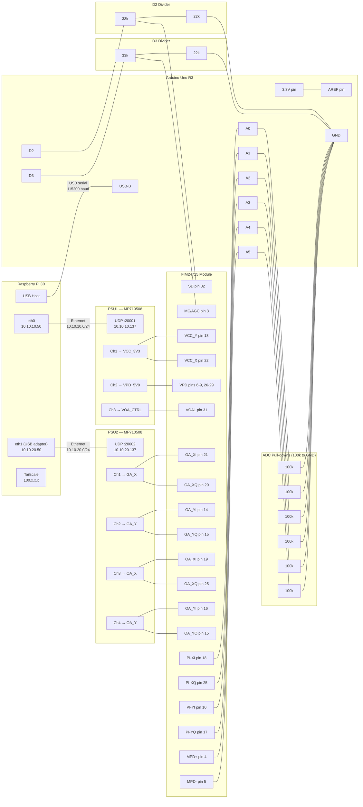

# FIM24725 Control System — Wiring Schema

## Full System Wiring



## Circuit Details

### AREF (Analogue Reference)

```
Arduino 3.3V pin ──── AREF pin (direct connection)
                       │
               analogReference(EXTERNAL)
               ADC range: 0-3.3V
               Resolution: 3.3V / 1024 = 3.2 mV/count
```

### Voltage Dividers (D2 and D3)

```
Arduino D2/D3 (5V digital output)
      │
    [33k]   series resistor
      │
      ├──────── output to FIM24725 pin
      │           Vout = 5V x 22k/(33k+22k) = 2.0V
    [22k]   pull-down to ground
      │
     GND

When pin = HIGH (5V):  output = 2.0V  (FIM24725 HIGH threshold: 2.0V-VCC)
When pin = LOW  (0V):  output = 0.0V  (FIM24725 LOW threshold:  0-0.8V)
```

### ADC Inputs (A0-A5)

```
FIM24725 PI/MPD output ──── Arduino Ax (ADC input)
                              │
                           [100k]   pull-down resistor
                              │
                             GND

Pull-downs ensure ADC reads 0V when module is off
(pins would otherwise float to undefined voltage).
100k is high enough not to load the PI/MPD outputs.
Signal range: 0-2V
ADC range:    0-3.3V (set by AREF)
Utilises ~62% of ADC range (0-621 counts)
```

### Ethernet (Raspberry Pi to PSUs)

```
Raspberry Pi
  eth0  (onboard)       ──── Ethernet ──── PSU1  10.10.10.137:20001
  10.10.10.50                               (VCC_3V3, VPD_5V0, VOA_CTRL)

  eth1  (USB adapter)   ──── Ethernet ──── PSU2  10.10.20.137:20002
  10.10.20.50                               (GA_X, GA_Y, OA_X, OA_Y)

  wlan0 / eth (Tailscale) ── WireGuard ── Remote user (100.x.x.x)
```
